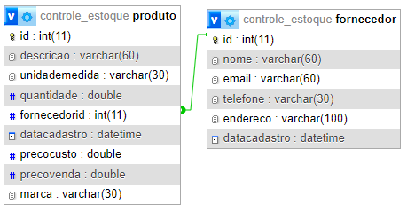

# controle_estoque_JDBC
Realizado um CRUD de controle de estoque, contendo apenas duas entidades: Produto e Fornecedor. Sendo utilizado apenas o JDBC para conectar com banco mySQL e o Maven para controle das dependencias.</br>
<p>O intuito principal aqui é apresentar uma implementação com o JDBC puro, sem as abstrações que um framework possibilita, como por exemplo o Hibernate.


### JDBC (ConectorJ)
```xml
<dependency>
   <groupId>com.mysql</groupId>
	<artifactId>mysql-connector-j</artifactId>
	<version>8.4.0</version>
</dependency>
```

### Diagrama Relacional



